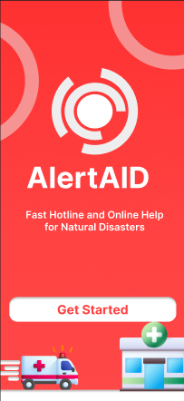
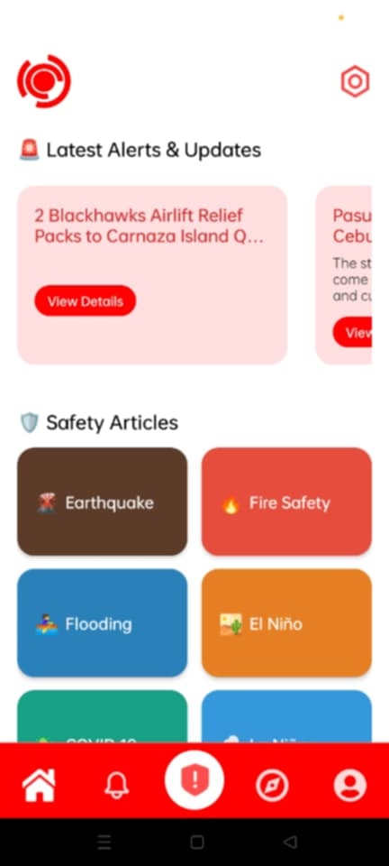

# AlertAID
AlertAID Mobile App - Emergency Response and Disaster Management Solution

# Features
* Emergency Hotline Directory – Quick access to Toledo City emergency hotlines (police, fire, medical, disaster response).
* One-Tap SOS Alert – Instantly send an alert with location details to emergency services while emitting a distress sound for emergencies like landslides, flash floods, or crime-related situations.
* Real-Time Notifications – Receive updates on disasters, road blockages, emergency protocols, and government announcements/events in Cebu Province.
* Emergency Map & Navigation – Interactive Google Map view of Toledo City showing evacuation centers and LGUs with routing to nearest shelters, real-time weather data, and Project NOAH hazard integration.
* Safety Resources & Education – Access safety articles and instructional videos from our live server for disaster preparedness.
* Offline Mode – Access critical emergency contacts and essential features without internet connection.

# Use Cases
* Toledo City Residents – Quickly access local emergency services, evacuation centers, and disaster information during emergencies.
* Local Government Units (LGUs) – Provide citizens with centralized emergency information and resources for better community preparedness.
* General Public & Visitors – Access safety information, evacuation routes, and real-time alerts while in Toledo City.

# Course Overview
* Cross-Platform Mobile Development – Building responsive UIs with React Native and Expo for iOS and Android.  
* Cloud Backend Integration – Implementing real-time databases, authentication, and serverless functions with Firebase
* Real-Time Alert Systems – Developing live update services and notification pipelines with Vercel.
* Emergency Response Systems – Developing SOS features, location services, and notification systems.
* Offline-First Architecture – Ensuring critical functionality without internet connectivity.
* Production Deployment – Configuring EAS Build for mobile app distribution and Vercel for live data services.

# Tech Stack
@ Frontend & Mobile
* React Native - Cross-platform mobile framework
* Expo - Development platform and build tools
* Tailwind CSS - Utility-first styling framework
* JavaScript/TypeScript - Core programming language

@ Backend & Infrastructure
* Firebase - Backend-as-a-Service platform
Firestore/Realtime Database - NoSQL database
Firebase Functions - Serverless backend
Firebase Authentication - User management
* Vercel - Live data server for real-time alerts and updates
* Node.js - Runtime environment

@ Development & Deployment
* EAS (Expo Application Services) - Mobile app build and deployment
* Vercel - Live update server hosting and API deployment
* Android - Native mobile platform
* Git - Version control

@ Architecture
* Hybrid Cloud Setup - Firebase for user data + Vercel for live alert services
* Real-time Data Flow - Vercel server processes and distributes emergency alerts
* Multi-Service Integration - Seamless communication between mobile app, Firebase, and Vercel services

# Onboarding Screen
  

# Sign Up Screen
  

# Sign In Screen
  

# Home Screen
  
