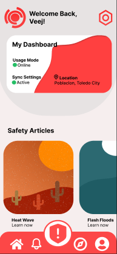

# AlertAID
AlertAID Mobile App.

# Features
* Emergency Hotline Directory – Quick access to essential hotlines (police, fire, medical, disaster response).  
* One-Tap SOS Alert – Instantly send an alert with location details to emergency services.  
* Real-Time Notifications – Receive updates on disasters, road blockages, and emergency protocols.  
* Incident Reporting – Report emergencies with images, descriptions, and GPS location.  
* Offline Mode – Access critical emergency contacts even without an internet connection.  
* User Profile & Preferences – Customize preferred emergency contacts and notification settings.  

# Use Cases
* Residents in Emergencies – Quickly contact the right emergency service based on the situation.  
* Local Government & Disaster Response Teams – Improve communication and coordination for disaster management.  
* Healthcare & First Responders – Receive real-time incident reports for faster medical response.  

# Course Overview
* Building with React & Vite – Creating fast and responsive UI components.  
* Database & API Integration – Managing user data, emergency contacts, and reports.  
* User Authentication – Secure login and user profile management.  
* Deployment & Hosting – Deploying the app using **EAS Hosting** for real-world use. 

# Tech Stack
* React Native | React.JS
* Firebase 
* HTML, CSS and JS

# Onboarding Screen
  

# Sign Up Screen
  

# Sign In Screen
  

# Home Screen
  